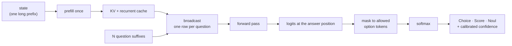
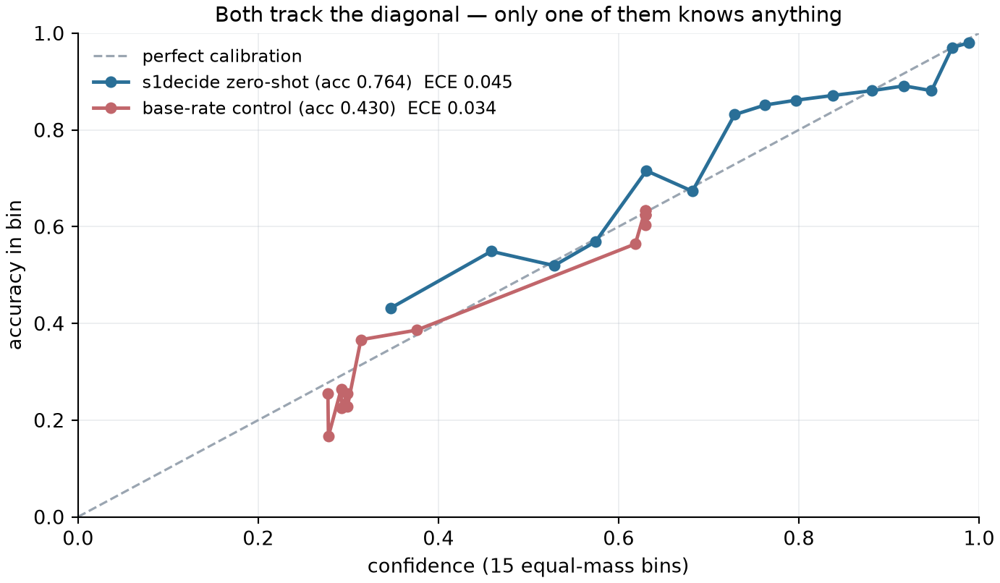
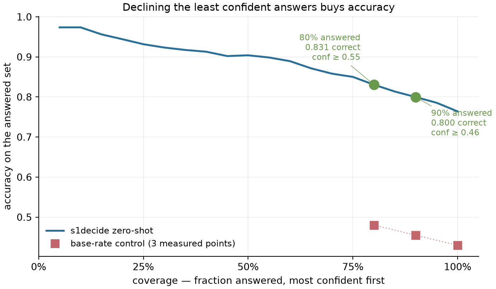
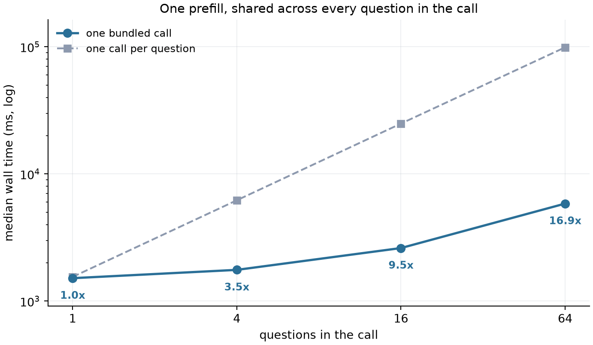
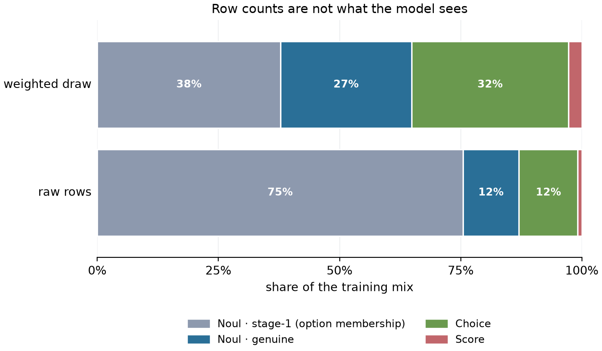
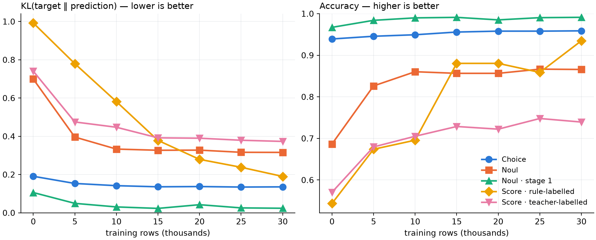

# s1decide

**Pre-alpha.** Stage 1 has been trained once, on one RTX 3090, and is measured so far only
in-distribution; the comparison with other models on fair ground (OOD sets, unseen families and
languages) is in progress, and no weights are published yet. Every
number and every figure on this page is generated from a JSON file under `results/` and checked
against it by a test — none is typed or drawn by hand, here or anywhere else in the repository.

`s1decide` answers typed questions about a piece of state in **one forward pass**:

| primitive | question | returns |
|---|---|---|
| `Choice` | one option from a caller-supplied set | probabilities over options, confidence |
| `Score` | a position on an ordered rubric | probabilities over levels, expected level, confidence |
| `Noul` | is this statement true | probability |

There is no autoregressive decoding anywhere in the path. Each option maps to a single token;
the logits at one answer position are masked to the allowed tokens and softmaxed, so an
off-schema answer is impossible by construction. Many questions about the same state are
answered over one prefilled cache.



## Context

TypeSafe's **Jev** made the case that a small, fast model answering *typed* questions — pick one
of these options, rate this on a scale, is this true — is a better primitive for software than
a chat model coaxed into JSON. That framing is theirs and we think it is right.

What Jev does not publish is the part that would let you check it: no weights, no calibration
curves, no architecture, no evaluation you can re-run. You can measure its answers only through
its API, and you cannot tell whether a confidence of 0.9 means anything.

`s1decide` is the open version of that idea. Apache-2.0 weights on an open base model, the
training and evaluation pipeline in this repository, and — the part we care most about —
**calibration measured and published**, with the negative controls that make the measurement
honest, on hardware anyone can rent for a few pounds an hour.

We are not claiming parity. We are claiming it is checkable.
[`docs/research/jev-landscape-2026-09-17.md`](docs/research/jev-landscape-2026-09-17.md) is the
dated, sourced basis for everything we say about them; it is the file to correct if we have got
something wrong.

## What works today

| | status |
|---|---|
| Inference engine (`transformers`, 4-bit, cache broadcast) | working, benchmarked |
| Data pipeline — 15 sources, licence-gated, two-stage expansion | working |
| Evaluation harness — calibration, skill, risk-coverage, two negative controls | working |
| Latency benchmark against the definition of done | working, all four targets met |
| Zero-shot baseline on the 27B | measured and committed |
| **Stage-1 QLoRA training** | **trained once on an RTX 3090 (`s1-3090`); in-distribution only so far** |
| Stage-2 calibration — temperature and vector scaling | fitted on S1 per option count; per-primitive fitting (ADR 0008) next |
| GGUF export, `/decide` server | not started |

## Measured so far

Base model, no fine-tuning, 4-bit on one RTX 3090. **This is the baseline S1 has to beat, not a
result.**

<!--metrics:zeroshot-->
| | value |
|---|---|
| Accuracy | 0.7638 |
| Brier skill vs base rate | +0.4598 |
| ECE (15 equal-mass bins) | 0.0428 |
| Accuracy at 80% coverage | 0.8306 |
<!--/metrics:zeroshot-->

<!--metrics:zeroshot-provenance-->
Evaluated on `pngwn/system-one-decisions` `test` — 1,520 questions, eval mode `full`, run `20260923-format02-zeroshot-fp32logit`.
<!--/metrics:zeroshot-provenance-->

Read the Brier skill score before the ECE. A base-rate control — a predictor that ignores the
state entirely — scores a *better* ECE than this model while being 33 accuracy points worse.
That is what ECE does, and it is why the headline calibration number here is skill against that
control, which a non-committal predictor cannot win.

<!--figure:reliability-->


*Zero-shot, calibrated, with the base-rate control on the same axes. Generated from `20260923-format02-zeroshot-fp32logit` · NVIDIA GeForce RTX 3090 · nf4-bf16.*
<!--/figure:reliability-->

<!--figure:risk-coverage-->


*Accuracy on the answered set as the least confident are declined. Generated from `20260923-format02-zeroshot-fp32logit` · NVIDIA GeForce RTX 3090 · nf4-bf16.*
<!--/figure:risk-coverage-->

**One model, two 4-bit quantizations, different answers.** The same weights and the same 100
rows, scored under bitsandbytes nf4 and llama.cpp Q4_K_M, agree exactly on only 78% of a 5-level
ordinal judgement, and the disagreement has a direction. That is the measured reason calibration
is fitted at the deployment quantization rather than once:
[`docs/research/quantization-label-disagreement-2026-09-18.md`](docs/research/quantization-label-disagreement-2026-09-18.md).

Latency, same model and card, 1,617-token prefix:

<!--metrics:latency-->
| questions in one call | median | vs one call each | speedup |
|---|---|---|---|
| 1 | 1,515 ms | 1,550 ms | 1.02x |
| 4 | 1,761 ms | 6,207 ms | 3.53x |
| 16 | 2,614 ms | 24,899 ms | 9.52x |
| 64 | 5,847 ms | 99,092 ms | 16.95x |
<!--/metrics:latency-->

<!--figure:latency-->


*Bundled vs one call each, log scale. Speed-up annotated at each point. Generated from `20260917-220416-qwen38-27b-unsloth-bnb-4bit-nf4-bf16-latency` · NVIDIA GeForce RTX 3090 · nf4-bf16.*
<!--/figure:latency-->

Latency is **not flat** in the number of questions and we do not claim it is — a 64-question
call costs about 3.9x a 1-question call at this state size. Broadcasting amortises the *state*,
not the questions. Flatness holds only when the shared prefix is large relative to the
per-question text. [ADR 0003](docs/adr/0003-latency-target.md) derives the crossover and records
the target that was retired for measuring the benchmark's state size rather than the engine.

The corpus is stage-1 heavy by construction and the trainer does not see it that way:

<!--figure:training-mix-->


*Raw rows vs the weighted draw the trainer takes, by primitive and stage. Generated from `data/processed/manifest.json` · CPU.*
<!--/figure:training-mix-->

### S1 on one RTX 3090

A rank-8 QLoRA on the 4-bit 27B, 30,000 family-balanced rows, evaluated on a fixed validation
slice at every 5,000 rows. **In-distribution**: the slice is held-out states from the families
the model trains on; comparisons with other models on fair ground are still to come.

<!--figure:training-curve-->


*S1 on one RTX 3090: per-primitive KL (left) and accuracy (right) on the fixed val slice at every checkpoint. In-distribution. Generated from `s1-3090` · rtx3090_windows · nf4 QLoRA, rank 8.*
<!--/figure:training-curve-->

## Running it

Windows 11 with an RTX 3090 is the reference machine; everything runs unchanged on Linux.

```
uv sync
uv run task doctor     # GPU, CUDA, kernels, paths, encoding — read this first
uv run task data       # build the corpus into data/processed/ (deterministic)
uv run task test       # the CPU suite
uv run task test-gpu   # GPU tests, one file per process
uv run task eval       # score a model, write results/<run_id>/
uv run task bench      # latency against the definition of done
uv run task figures    # redraw this page's figures from results/
uv run task gpu-kill   # free the GPU after an interrupted run
```

`uv run task` with no arguments lists everything. Two commands are placeholders that fail
loudly rather than silently doing nothing: `smoke` and `train`.

Read [`docs/windows-setup.md`](docs/windows-setup.md) before the first GPU run. Three settings
there are not optional — the CUDA sysmem fallback policy, git long paths, and pausing Windows
Update, which restarted this machine five hours into an overnight job.

## Contributing — what would help

The most useful contributions are measurements we cannot make on one 3090.

- **The BF16 quantization row.** A BF16 27B forward pass does not fit in 24 GB, so v0.1 ships a
  quantization table with a hole in it ([ADR 0006](docs/adr/0006-release-scope.md)). One run on
  an 80 GB Linux GPU closes it.
- **The latency bench on other cards.** `uv run task bench` writes a self-describing
  `results/<run_id>/latency.json`. A PR adding your run, plus a hardware profile in
  `src/s1decide/hardware.py`, turns our single-card numbers into a curve. Use the
  [benchmark issue template](.github/ISSUE_TEMPLATE/benchmark.md).
- **Port the recipe to a larger base.** Nothing in `train/` or `eval/` is specific to
  Qwen3.8-27B beyond the tokenizer checks; a 70B run would say whether the calibration story
  holds at scale.
- **Independently replicate the two research notes** — the
  [latency amortisation](docs/research/latency-amortisation-2026-09-17.md) crossover and the
  [quantization label disagreement](docs/research/quantization-label-disagreement-2026-09-18.md).
  Both are small, both are cheap to re-run, and both are load-bearing for decisions we have
  already made. A failure to replicate is the most valuable thing you could send us.

Every number in a PR must come from a committed `results/` JSON, produced by a script in
`eval/`. That rule applies to us too, and the tests enforce it.

## Documentation

| | |
|---|---|
| [`CLAUDE.md`](CLAUDE.md) | locked architecture decisions, hard rules, definition of done |
| [`AGENTS.md`](AGENTS.md) | the working roles and their hand-off checklists |
| [`docs/phase-1-plan.md`](docs/phase-1-plan.md) | what is being built now, step by step |
| [`docs/format-spec.md`](docs/format-spec.md) | the prompt format, versioned and generated |
| [`docs/model-card.md`](docs/model-card.md) | **draft** — every number a slot pointing at a `results/` path |
| [`docs/dataset-card.md`](docs/dataset-card.md) | sources, licences, file-format guarantees |
| [`docs/dataset-build.md`](docs/dataset-build.md) | generated: row counts, effective training mix, leakage |
| [`docs/windows-setup.md`](docs/windows-setup.md) | reproducing the environment on this machine |
| [`docs/adr/`](docs/adr/) | decisions, with the measurements behind them |
| [`docs/research/`](docs/research/) | dated notes; the factual basis for design choices |

The ADRs are the honest record. [0003](docs/adr/0003-latency-target.md) retires a latency
target that was ours and wrong. [0005](docs/adr/0005-ambiguous-source-licences.md) says which
data we declined to use and why. [0006](docs/adr/0006-release-scope.md) scopes v0.1 to a
pre-release and names what it will not measure.

## Licence

Apache-2.0. Training data is licence-gated by [ADR 0004](docs/adr/0004-training-data-licence-gate.md):
every row in a training split carries a licence from an allowlist, enforced by a test rather
than by a comment. Non-commercial and share-alike sources are evaluation-only.
