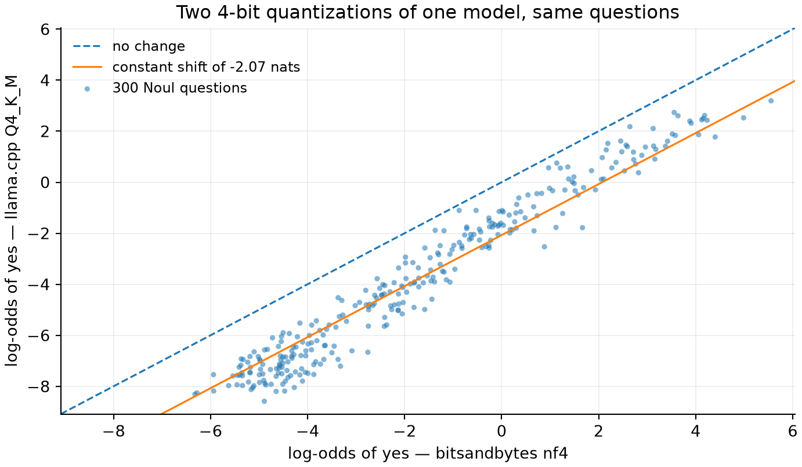

# Two 4-bit quantizations of one model disagree by a constant

**Date:** 2026-09-23
**Measured on:** 300 `Noul` questions from `test`, 150 genuine and 150 stage-1, seed 20260923
**Runtimes:** `unsloth/Qwen3.8-27B-unsloth-bnb-4bit` (nf4, `HFEngine`) against
`unsloth/Qwen3.8-27B-GGUF / Qwen3.8-27B-UD-Q4_K_M.gguf` (llama-server)
**Numbers:** `results/quant-noul/` · **Figure:** `uv run task quant-noul --figure`

This is the short, publishable form. The full method, the five alternative explanations ruled
out, and the harness bug found along the way are in
[`noul-quantization-stability-2026-09-23.md`](noul-quantization-stability-2026-09-23.md).

## The picture

Each point is one question, scored by two 4-bit quantizations of the same 27B model, on the
identical rendered prompt with the identical option token ids.

Noise would scatter the points *about* the diagonal. Instead they sit on a line **parallel** to
it: slope near 1, intercept about **−2 nats**. Every one of the 300 moved the same way.

| | value |
|---|---|
| mean shift in log-odds | **−2.074** |
| median | −2.043 |
| standard deviation | 0.727 |
| slope against nf4's log-odds | +0.12 |
| rows shifted down | **300 of 300** |
| sign test | p ≈ 1e-90 |
| decisions still agreeing | 89.3% |

A shift, not a rescale. That distinction decides what can repair it.

## Why it matters: temperature cannot repair a shift

Temperature scaling divides the logits. Division is monotone, so `sigmoid(z/T) ≥ 0.5` exactly
when `z ≥ 0` — **no temperature can move a two-option decision**, whatever value it takes. A
per-option bias can, because it moves the crossing point.

The measurement matches the algebra rather than merely agreeing with it:

| correction applied to Q4_K_M | agreement with nf4's decision | mean \|Δp\| |
|---|---|---|
| none | 0.893 | 0.1256 |
| temperature only, best `T` = 1.82 | **0.893** | 0.1014 |
| per-option bias only, `b` = +2.074 | 0.923 | 0.0493 |
| vector scaling, `T` = 1.17, `b` = +1.35 | **0.953** | 0.0382 |

Temperature buys **exactly zero** decision agreement. Vector scaling buys 6.0 points and brings
the probabilities 3.3× closer.

## What changed because of it

- **GGUF artefacts deploy vector scaling by default**; temperature stays fitted and reported
  beside it, so each quantization row shows whether its cost is confidence or position. A
  temperature-only table would present as irreducible a cost that one parameter removes.
- **Calibration is fitted per (quantization × primitive)**, and `calibration.json` carries the
  method and parameters for each. A fit is never borrowed across quantizations: on this evidence
  a borrowed fit is wrong by about two nats, and an identity fit is at least honestly
  uncalibrated.
- **The fit target is always the validation split's own labels.** Never agreement with nf4.

## nf4 is a reference, not a judge

The table above measures *agreement with nf4*, because the question was whether quantization
moves an answer. It is not a claim that nf4 is right. Against the true labels Q4_K_M is the
better of the two here — NLL 0.289 against 0.393, Brier 0.094 against 0.127 — so correcting
Q4_K_M toward nf4 makes it agree more and score worse.

nf4 is the diagnostic reference because it is what our other measurements run on, and that is the
whole of its authority. Which quantization is closer to the model as trained cannot be settled on
a 24 GiB card, because the arbiter is BF16 and a BF16 27B forward pass does not fit. That is the
hole v0.1 ships with, and this measurement makes it sharper rather than smaller.

## Caveats worth carrying

- Two artifacts, not two algorithms: Unsloth's dynamic bnb recipe against Unsloth's dynamic GGUF
  recipe, both from the same base. It is the comparison a user actually faces, and it is not a
  controlled study of nf4 versus Q4_K_M in isolation.
- Two options. Whether the offset is one constant or one per option position, and whether it
  holds for a five-level `Score`, is untested and cheap to test now that both scoring paths
  exist.
- 300 questions, one model, one prompt format.
