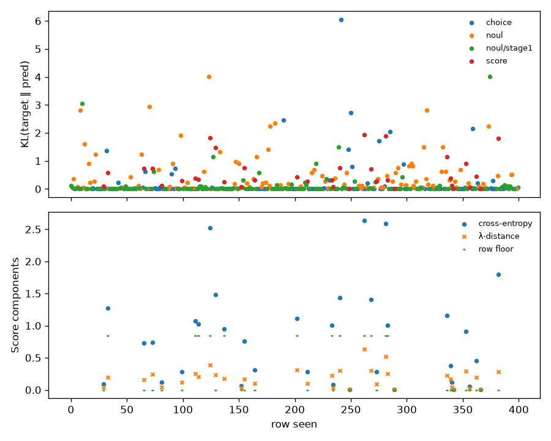

# s1-3090-smoke — coverage and loss

Generated by `train/sft_lora.py:write_report` from `train_summary.json`.

Rows seen by the optimiser: 400 (of 400 selected), 50 steps.

## Loss by qtype (per row, rows seen)

KL(target ‖ pred) is the column to read: it is cross-entropy on a hard row and zero at
the optimum on a soft one. The raw total carries a soft row's floor (ln 2 plus
λ·0.5 for a 50/50 split) and so moves with the hard/soft mix of the window.

| qtype | rows | soft | KL first 10 | KL last 10 | total first 10 | total last 10 | floor first 10 | floor last 10 |
|---|---|---|---|---|---|---|---|---|
| choice | 112 | 0 | 0.1394 | 0.0446 | 0.1394 | 0.0446 | 0.0000 | 0.0000 |
| noul | 253 | 0 | 0.3445 | 0.1577 | 0.3445 | 0.1577 | 0.0000 | 0.0000 |
| score | 35 | 12 | 0.6552 | 0.4868 | 1.1207 | 0.6086 | 0.3373 | 0.0000 |

## Coverage (rows seen)

| qtype | rows | share |
|---|---|---|
| choice | 112 | 28.0% |
| noul | 107 | 26.8% |
| noul/stage1 | 146 | 36.5% |
| score | 35 | 8.8% |

| family | rows | share |
|---|---|---|
| banking77 | 53 | 13.2% |
| clinc_oos | 44 | 11.0% |
| go_emotions | 55 | 13.8% |
| massive_de | 47 | 11.8% |
| massive_en | 45 | 11.2% |
| massive_tr | 48 | 12.0% |
| mmlu | 21 | 5.2% |
| mmlu_noul | 52 | 13.0% |
| ordinal_control | 3 | 0.8% |
| score_teacher | 32 | 8.0% |

| target | rows | share |
|---|---|---|
| hard | 388 | 97.0% |
| soft | 12 | 3.0% |

| option_count | rows | share |
|---|---|---|
| 2 | 253 | 63.2% |
| 3 | 1 | 0.2% |
| 4 | 22 | 5.5% |
| 5 | 33 | 8.2% |
| 8 | 91 | 22.8% |
