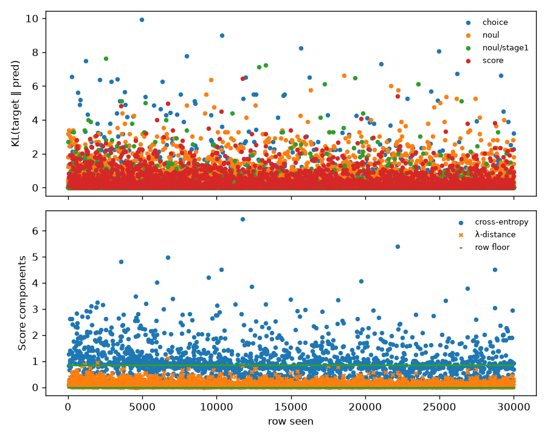

# s1-3090 — coverage and loss

Generated by `train/sft_lora.py:write_report` from `train_summary.json`.

Rows seen by the optimiser: 30000 (of 30000 selected), 3750 steps.

## Loss by qtype (per row, rows seen)

KL(target ‖ pred) is the column to read: it is cross-entropy on a hard row and zero at
the optimum on a soft one. The raw total carries a soft row's floor (ln 2 plus
λ·0.5 for a 50/50 split) and so moves with the hard/soft mix of the window.

| qtype | rows | soft | KL first 10 | KL last 10 | total first 10 | total last 10 | floor first 10 | floor last 10 |
|---|---|---|---|---|---|---|---|---|
| choice | 8998 | 0 | 0.1366 | 0.5544 | 0.1366 | 0.5544 | 0.0000 | 0.0000 |
| noul | 18064 | 0 | 0.3804 | 0.3616 | 0.3804 | 0.3616 | 0.0000 | 0.0000 |
| score | 2938 | 915 | 0.6447 | 0.5041 | 1.1057 | 0.7790 | 0.3373 | 0.1686 |

## Coverage (rows seen)

| qtype | rows | share |
|---|---|---|
| choice | 8998 | 30.0% |
| noul | 7464 | 24.9% |
| noul/stage1 | 10600 | 35.3% |
| score | 2938 | 9.8% |

| family | rows | share |
|---|---|---|
| banking77 | 3656 | 12.2% |
| clinc_oos | 3577 | 11.9% |
| go_emotions | 3785 | 12.6% |
| massive_de | 3615 | 12.0% |
| massive_en | 3670 | 12.2% |
| massive_tr | 3595 | 12.0% |
| mmlu | 1485 | 5.0% |
| mmlu_noul | 3679 | 12.3% |
| ordinal_control | 386 | 1.3% |
| score_teacher | 2552 | 8.5% |

| target | rows | share |
|---|---|---|
| hard | 29085 | 97.0% |
| soft | 915 | 3.0% |

| option_count | rows | share |
|---|---|---|
| 2 | 18064 | 60.2% |
| 3 | 132 | 0.4% |
| 4 | 1605 | 5.3% |
| 5 | 2686 | 9.0% |
| 8 | 7513 | 25.0% |
