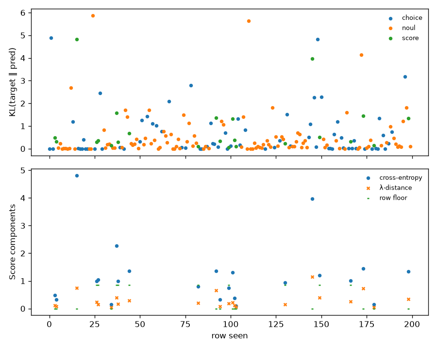

# smoke-27b-longest — coverage and loss

Generated by `train/sft_lora.py:write_report` from `train_summary.json`.

Rows seen by the optimiser: 200 (of 200 selected), 200 steps.

## Loss by qtype (per row, rows seen)

KL(target ‖ pred) is the column to read: it is cross-entropy on a hard row and zero at
the optimum on a soft one. The raw total carries a soft row's floor (ln 2 plus
λ·0.5 for a 50/50 split) and so moves with the hard/soft mix of the window.

| qtype | rows | soft | KL first 10 | KL last 10 | total first 10 | total last 10 | floor first 10 | floor last 10 |
|---|---|---|---|---|---|---|---|---|
| choice | 70 | 0 | 0.6498 | 0.6100 | 0.6498 | 0.6100 | 0.0000 | 0.0000 |
| noul | 107 | 0 | 0.3014 | 0.5377 | 0.3014 | 0.5377 | 0.0000 | 0.0000 |
| score | 23 | 10 | 0.9051 | 0.9761 | 1.5671 | 1.5333 | 0.5059 | 0.2529 |

## Coverage (rows seen)

| qtype | rows | share |
|---|---|---|
| choice | 70 | 35.0% |
| noul | 107 | 53.5% |
| score | 23 | 11.5% |

| family | rows | share |
|---|---|---|
| mmlu | 70 | 35.0% |
| mmlu_noul | 107 | 53.5% |
| score_teacher | 23 | 11.5% |

| target | rows | share |
|---|---|---|
| hard | 190 | 95.0% |
| soft | 10 | 5.0% |

| option_count | rows | share |
|---|---|---|
| 2 | 107 | 53.5% |
| 4 | 70 | 35.0% |
| 5 | 23 | 11.5% |
