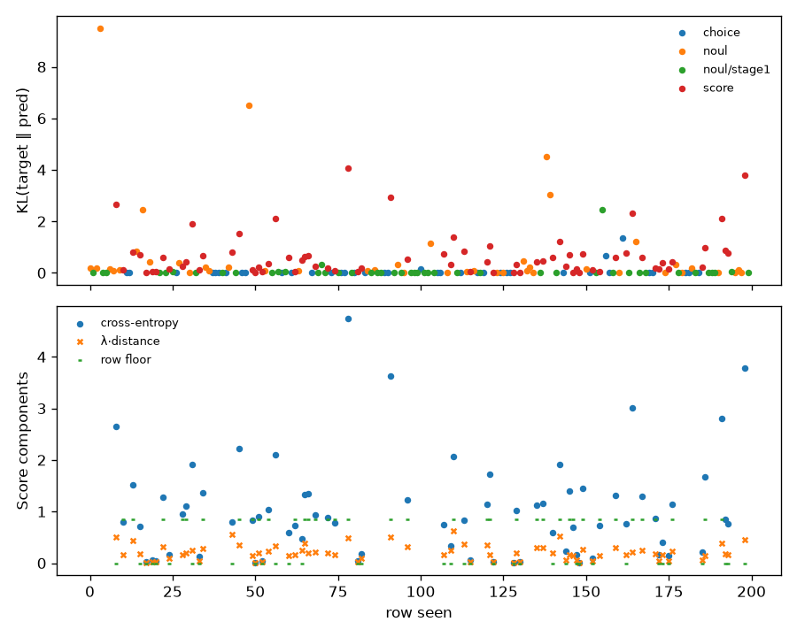

# smoke-27b-rank16 — coverage and loss

Generated by `train/sft_lora.py:write_report` from `train_summary.json`.

Rows seen by the optimiser: 200 (of 200 selected), 200 steps.

## Loss by qtype (per row, rows seen)

KL(target ‖ pred) is the column to read: it is cross-entropy on a hard row and zero at
the optimum on a soft one. The raw total carries a soft row's floor (ln 2 plus
λ·0.5 for a 50/50 split) and so moves with the hard/soft mix of the window.

| qtype | rows | soft | KL first 10 | KL last 10 | total first 10 | total last 10 | floor first 10 | floor last 10 |
|---|---|---|---|---|---|---|---|---|
| choice | 38 | 0 | 0.0046 | 0.2033 | 0.0046 | 0.2033 | 0.0000 | 0.0000 |
| noul | 89 | 0 | 1.1067 | 0.0208 | 1.1067 | 0.0208 | 0.0000 | 0.0000 |
| score | 73 | 37 | 0.5418 | 0.9877 | 1.0130 | 1.3835 | 0.3373 | 0.2529 |

## Coverage (rows seen)

| qtype | rows | share |
|---|---|---|
| choice | 38 | 19.0% |
| noul | 44 | 22.0% |
| noul/stage1 | 45 | 22.5% |
| score | 73 | 36.5% |

| family | rows | share |
|---|---|---|
| banking77 | 23 | 11.5% |
| clinc_oos | 29 | 14.5% |
| go_emotions | 32 | 16.0% |
| massive_de | 12 | 6.0% |
| massive_en | 9 | 4.5% |
| massive_tr | 8 | 4.0% |
| mmlu | 2 | 1.0% |
| mmlu_noul | 12 | 6.0% |
| ordinal_control | 9 | 4.5% |
| score_teacher | 64 | 32.0% |

| target | rows | share |
|---|---|---|
| hard | 163 | 81.5% |
| soft | 37 | 18.5% |

| option_count | rows | share |
|---|---|---|
| 2 | 89 | 44.5% |
| 3 | 3 | 1.5% |
| 4 | 3 | 1.5% |
| 5 | 69 | 34.5% |
| 8 | 36 | 18.0% |
