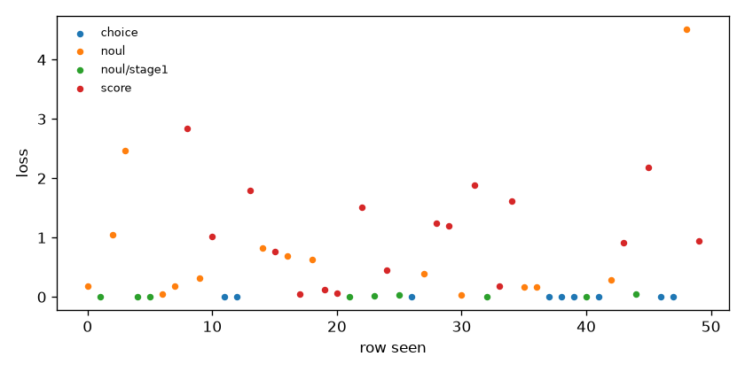

# smoke-27b — coverage and loss

Generated by `train/sft_lora.py:write_report` from `train_summary.json`.

Rows seen by the optimiser: 50 (of 200 selected), 50 steps.

## Loss by qtype (per-row, rows seen)

| qtype | rows | mean first 10 | mean last 10 |
|---|---|---|---|
| choice | 9 | 0.0004 | 0.0004 |
| noul | 24 | 0.5080 | 0.5617 |
| score | 17 | 0.9847 | 1.2112 |

## Coverage (rows seen)

| qtype | rows | share |
|---|---|---|
| choice | 9 | 18.0% |
| noul | 15 | 30.0% |
| noul/stage1 | 9 | 18.0% |
| score | 17 | 34.0% |

| family | rows | share |
|---|---|---|
| banking77 | 7 | 14.0% |
| clinc_oos | 5 | 10.0% |
| go_emotions | 9 | 18.0% |
| massive_de | 1 | 2.0% |
| massive_en | 4 | 8.0% |
| massive_tr | 1 | 2.0% |
| mmlu_noul | 6 | 12.0% |
| score_teacher | 17 | 34.0% |

| target | rows | share |
|---|---|---|
| hard | 42 | 84.0% |
| soft | 8 | 16.0% |

| option_count | rows | share |
|---|---|---|
| 2 | 24 | 48.0% |
| 5 | 17 | 34.0% |
| 8 | 9 | 18.0% |
