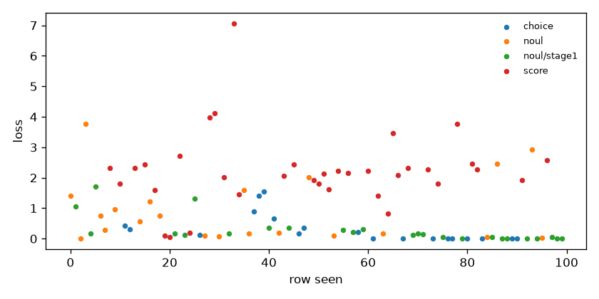

# smoke-small — coverage and loss

Generated by `train/sft_lora.py:write_report` from `train_summary.json`.

Rows seen by the optimiser: 100 (of 200 selected), 50 steps.

## Loss by qtype (per-row, rows seen)

| qtype | rows | mean first 10 | mean last 10 |
|---|---|---|---|
| choice | 19 | 0.6148 | 0.0278 |
| noul | 46 | 1.0687 | 0.5505 |
| score | 35 | 1.7564 | 2.4942 |

## Coverage (rows seen)

| qtype | rows | share |
|---|---|---|
| choice | 19 | 19.0% |
| noul | 21 | 21.0% |
| noul/stage1 | 25 | 25.0% |
| score | 35 | 35.0% |

| family | rows | share |
|---|---|---|
| banking77 | 13 | 13.0% |
| clinc_oos | 14 | 14.0% |
| go_emotions | 15 | 15.0% |
| massive_de | 8 | 8.0% |
| massive_en | 4 | 4.0% |
| massive_tr | 5 | 5.0% |
| mmlu_noul | 6 | 6.0% |
| ordinal_control | 1 | 1.0% |
| score_teacher | 34 | 34.0% |

| target | rows | share |
|---|---|---|
| hard | 81 | 81.0% |
| soft | 19 | 19.0% |

| option_count | rows | share |
|---|---|---|
| 2 | 46 | 46.0% |
| 5 | 35 | 35.0% |
| 8 | 19 | 19.0% |
